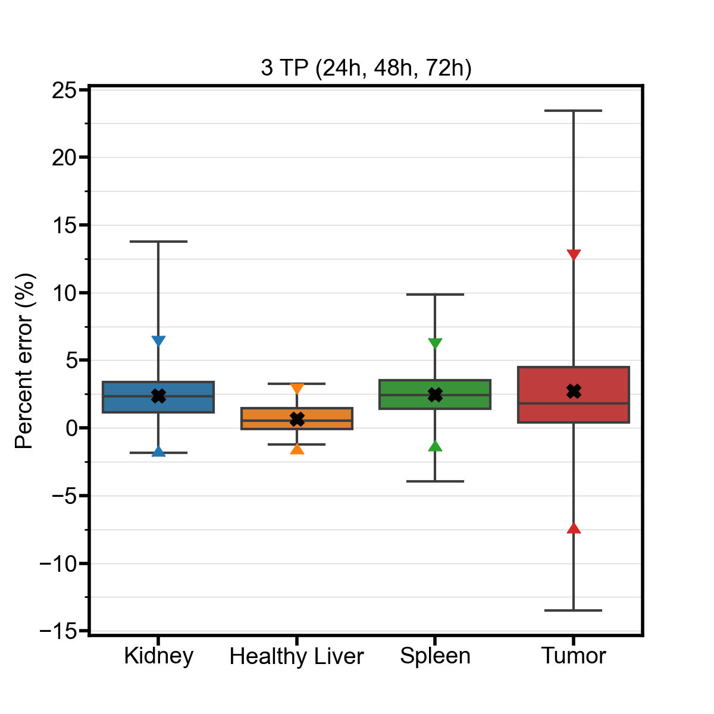

# Reduced Time Point Imaging Error Checker

`ReducedTPErrorChecker.py` is a Python program provided as a companion tool to the manuscript *Accuracy and uncertainty analysis of reduced time point imaging effect on time-integrated activity for 177Lu-DOTATATE PRRT in clinical patients and realistic simulations* and can be used to check the expected time-integrated activity error for a given sampling schedule based on simulated TIA data<br><br>
Program written by:<br>
Avery B Peterson<br>
Wayne State University & University of Michigan

## Installation

To use this tool, you will need to install the following Python packages:
- matplotlib
- numpy
- pandas
- seaborn
<!-- -->

You can install these packages using [pip](https://pip.pypa.io/en/stable/) and the provided `requirements.txt` file:

```
pip install -r requirements.txt
```

The tool has only been tested with Python 3.9.6, but likely works with other versions of Python as well.

## Usage

The tool is intended to be called from the command line. It must be launched from the same directory as the four CSV files `H_diff.csv`, `M_diff.csv`, `2TP_diff.csv`, and `3TP_diff.csv` which contain TIA percent differences as a result of applying the respective reduced time point method for many different sampling schedules.

```
python ReducedTPErrorChecker.py
```

Once initialized, the user will be greeted with the following prompt, at which point the user may enter up to 3 imaging times separated by commas and press Enter:

```
Enter up to three imaging times (in h) as a comma-separated list:

```
To exit the program, the user can type 'exit' or press Ctrl+C instead of entering time points.

## Example

```
python ReducedTPErrorChecker.py
Enter up to three imaging times (in h) as a comma-separated list:
24,48,72
Closest match: 24h, 48h, 72h

```

After entering three time points (24, 48, and 72 h), the program tells the user that the closest matching sampling schedule from the simulated data is, in fact, an exact match. The tool generates a plot showing the TIA percent error distribution with a box plot for Kidney, Healthy Liver, Spleen, and Tumor indicating the minimum, maximum, and interquartile range for each. Also indicated is the mean percent error (black 'X') and 95% confidence interval (colored triangles). <br>

A table that summarizes the various error metrics is also generated.<br>

Once both matplotlib figures are closed, the program will once again prompt the user to:

```
Enter up to three imaging times (in h) as a comma-separated list:

```
